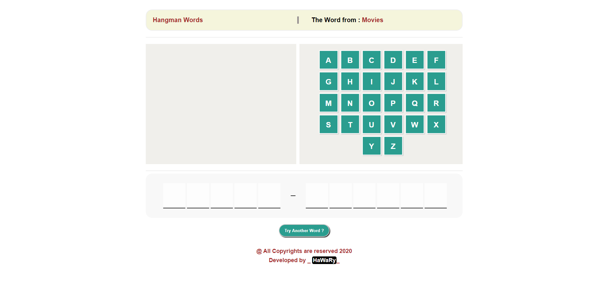

# Hangman Words

  

Hangman Words is a Game App. depends on how you can complete the Missed Word before your Tries are finished that means the Hangman is dead.
  

## Demo and How to Interact  

* The App. gets a Random word from a Random Category every time you try to play the Game.  
* The App. depends on 4 different Categories which contain multiple Words that Special for each Category.  

## Getting Started

You can try the Game APP from [here](https://mohamed-elhawary.github.io/hangman-words/)

### Prerequisites

Just Modern Browser like "Chrome" and a Code Editor for Deployment and Develop.

## Built With

* HML5
* CSS3
* Vanilla JS 

## Author

* Mohamed Elhawary  

## Contact Me  

* Email: mohamed.k.elhawary@gmail.com

## Deploy with Me

Feel Free to Deploy it with me, send Issues or a Pull Request and i'll deal with you, just test it First.

## License

Licensed under the [MIT License](LICENSE)

